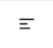
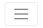

# Sales Breakdown

This project was bootstrapped with [Create React App](https://github.com/facebook/create-react-app).

## References used
  - [Navigation Bar and Sidebar](https://codeburst.io/how-to-create-a-navigation-bar-and-sidebar-using-react-348243ccd93) to implement header, sidebar, and content area
  - [Toggle Switch Component](https://upmostly.com/tutorials/build-a-react-switch-toggle-component) to implement the "Actions" column toggle switches
  - [Custom Dynamic Table](https://dev.to/abdulbasit313/an-easy-way-to-create-a-customize-dynamic-table-in-react-js-3igg) to create a nice-looking dynamic table on the home page

## *Remarks*
  - The top-left (i.e., 3 lines) button in the Figma design *is* dynamically implemented in this project. It appears when the browser window size is shrunken to a small enough size, and disappears if the browser window size is large enough.
  - In other words,

&nbsp;&nbsp;&nbsp;&nbsp;&nbsp;&nbsp;&nbsp;&nbsp; appears as  when the browser window size is small enough.

## Available Scripts

In the project directory, you can run:

### `npm install`

followed by

### `npm start`

Runs the app in the development mode.\
Open [http://localhost:3000](http://localhost:3000) to view it in the browser.

The page will reload if you make edits.\
You will also see any lint errors in the console.

## Alternatively,

you can run

### `npm install`

followed by
### `yarn test`

if you have [yarn](https://classic.yarnpkg.com/en/docs/install#debian-stable) installed.

### Yarn
Make sure you have Yarn installed for package management.

Check with `yarn --version`

You might also want to upgrade Yarn if it's been a while.

`brew upgrade yarn`

If you don't have it, you can install Yarn with Homebrew. 

`brew install yarn`

Or with this shell script in macOS and generic Unix environments.

`curl -o- -L https://yarnpkg.com/install.sh | bash`

If you encounter any problems with installing Yarn, visit [https://classic.yarnpkg.com/en/docs/install](https://classic.yarnpkg.com/en/docs/install)

## Learn More

You can learn more in the [Create React App documentation](https://facebook.github.io/create-react-app/docs/getting-started).

To learn React, check out the [React documentation](https://reactjs.org/).

### Code Splitting

This section has moved here: [https://facebook.github.io/create-react-app/docs/code-splitting](https://facebook.github.io/create-react-app/docs/code-splitting)

### Analyzing the Bundle Size

This section has moved here: [https://facebook.github.io/create-react-app/docs/analyzing-the-bundle-size](https://facebook.github.io/create-react-app/docs/analyzing-the-bundle-size)

### Making a Progressive Web App

This section has moved here: [https://facebook.github.io/create-react-app/docs/making-a-progressive-web-app](https://facebook.github.io/create-react-app/docs/making-a-progressive-web-app)

### Advanced Configuration

This section has moved here: [https://facebook.github.io/create-react-app/docs/advanced-configuration](https://facebook.github.io/create-react-app/docs/advanced-configuration)

### Deployment

This section has moved here: [https://facebook.github.io/create-react-app/docs/deployment](https://facebook.github.io/create-react-app/docs/deployment)

### `yarn build` fails to minify

This section has moved here: [https://facebook.github.io/create-react-app/docs/troubleshooting#npm-run-build-fails-to-minify](https://facebook.github.io/create-react-app/docs/troubleshooting#npm-run-build-fails-to-minify)
